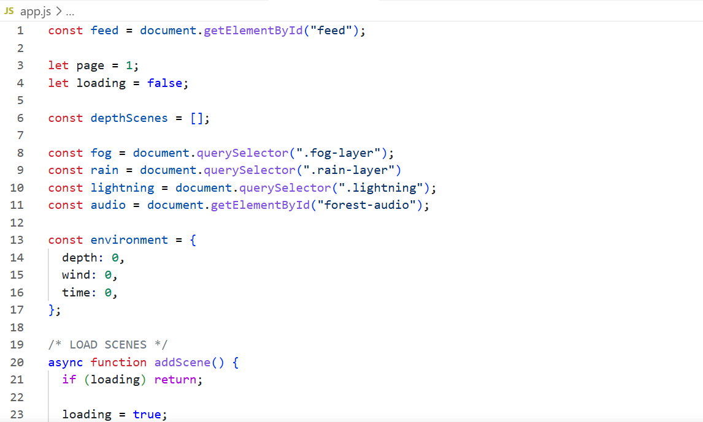

# Forest OS

An endless atmospheric forest scrolling experience built with vanilla JavaScript.

## Why I made this

I wanted to create a calm infinite digital forest that feels alive through motion, weather, ambient sound, and procedural poetry.

## Features

- Infinite scrolling forest photography
- Procedural poetry captions
- Dynamic fog and rain
- Ambient forest audio
- Lightning system
- Lightweight parallax engine

## Tech

- HTML
- CSS
- Vanilla JavaScript
- Unsplash API

## Screenshot

